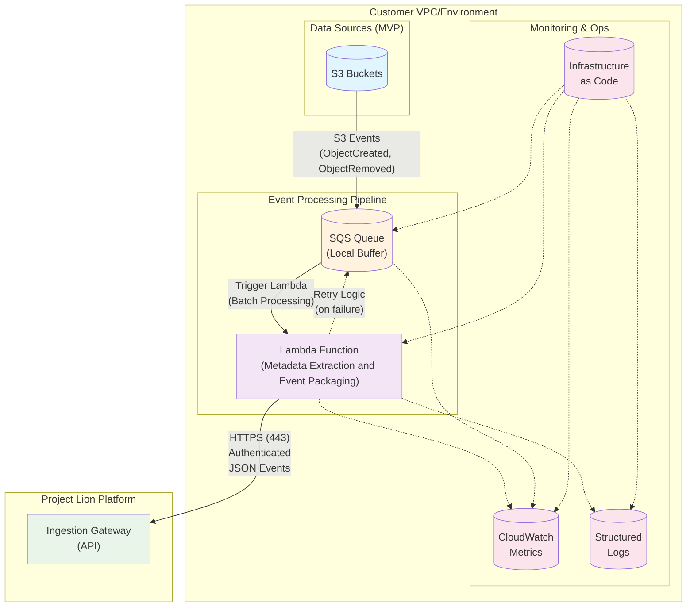
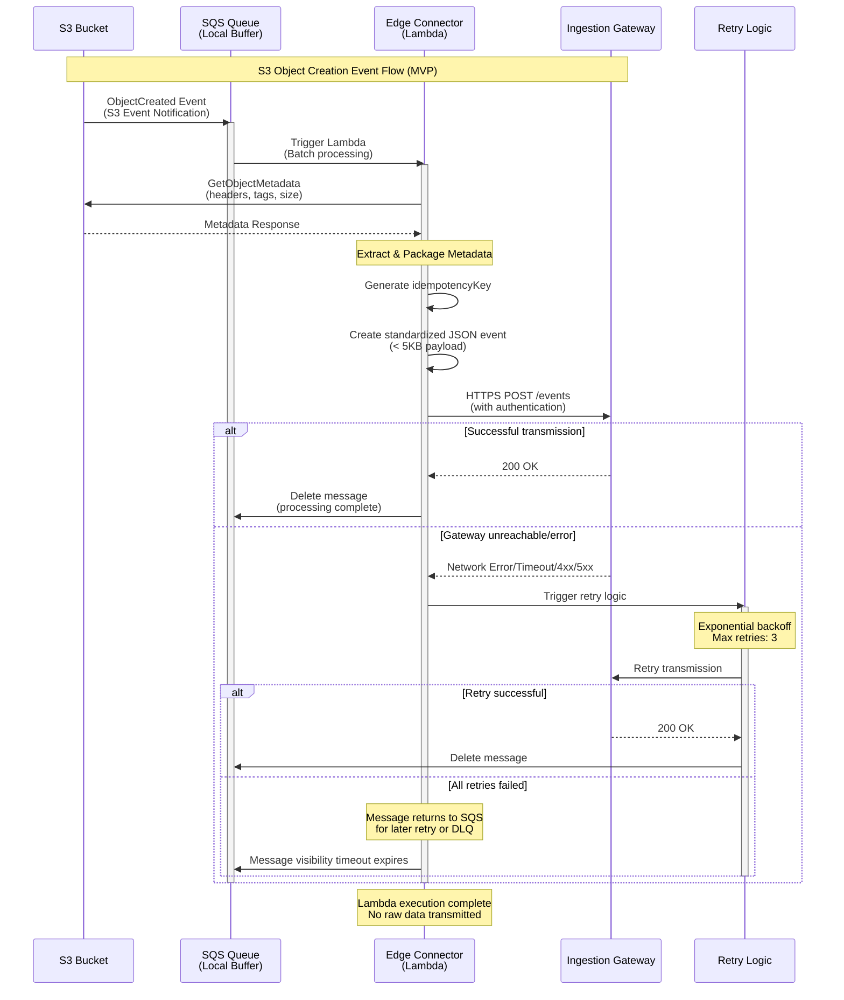

The Edge Connector is a crucial component of Project Lion, residing within the customer's VPC. Its primary role is to be a small and translate local change signals from customer data sources into metadata events, without ever storing or directly processing the raw data itself.

## Core Design

* **No Raw Data Transformation or Storage:** The Edge Connector may read raw file contents as needed to extract metadata (such as checksums, headers, or content type), but it never transfers raw data outside the customer environment or stores raw data in any local or temporary storage. Local buffers only hold event JSON.
* **No Credential Echoing:** Source system credentials are managed by the customer and are not transmitted back to Project Lion.

The Edge Connector is designed to be a trustworthy, minimal-footprint component that ensures secure and reliable metadata extraction from customer environments into Project Lion.

## Event Processing Flow

## Architecture Overview

The following diagram illustrates the Edge Connector's deployment options and data flow within the customer environment:

### Event Flow Sequence

The following sequence diagram shows the detailed interaction flow for an S3 event:

## Core Responsibilities

1. **Listen for Changes:**

   * **S3 (MVP):** Utilizes Lambda functions triggered by S3 events via SQS queue (`ObjectCreated`, `ObjectRemoved`, etc.).
   * **Future Sources:** JDBC Sources, Snowflake/BigQuery API history (planned for future releases).

2. **Package Metadata:** Transforms the source-specific signals into a standardized, compact JSON event (target < 5 KB) containing an `idempotencyKey`, `tenantId`, `eventType`, `timestamp`, and detailed `source` information (kind, location, size, checksums, relevant tags, geospatial metadata like BBOX and EPSG codes if available).

3. **Secure Transmission:** Signs and ships the JSON event payload to the Ingestion Gateway.

4. **Local Buffering:** If the Ingestion Gateway is unreachable, events are buffered locally with appropriate retry and back-off mechanisms.

5. **Observability:** Exposes metrics and/or structured logs to provide transparency to the customer about its operations.

6. **Controlled Updates:** Self-updates are managed by the customer's operations team; Cloudformation, Terraform, Lambda Layers or shared Docker Images.

## Deployment Footprint Options

Project Lion provides a single open-source TypeScript codebase for the Edge Connector, which can be built and deployed into various footprints depending on the data source:

* **AWS Lambda:** Ideal for S3 buckets; zero infrastructure management, pay-per-invocation, IAM permissions scoped per bucket.
* **AWS Fargate Task:** Suitable for JDBC polling; allows for long-running processes.
* **Kubernetes Sidecar:** For sources co-located with customer's Kubernetes workloads; scales with the job. Requires customer to have an EKS or other Kubernetes cluster.

## Security

* **Least Privilege IAM:** Connectors operate with minimal IAM permissions (`s3:GetObject` for headers, `s3:ListBucket` for discovery, and `execute-api:Invoke` for the Ingestion Gateway). Outbound HTTPS (port 443) is required.
* **Event Payload Security:** Hard payload size limits (proposed 50 KB) prevent accidental transmission of raw data.
* **API Key/Secret Pair or JWT Authentication:** Requests to the Ingestion Gateway are authenticated.
* **Egress-Only Architecture:** No inbound ports are required in the customer's VPC for the connector's operation.