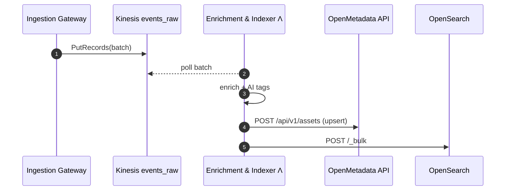

# Enrichment & Indexer

The **Enrichment & Indexer** Lambda (E&I) is Project Lion's real-time
processor downstream of the Ingestion Gateway.

1. **Consumes**: batches from the `events_raw` Kinesis stream
2. **Enriches**: tenant/dataset look‑ups, geo parsing, AI tag suggestions
3. **Publishes**:
   - **OpenMetadata REST API** - `POST /api/v1/assets` (UPSERT)
   - **OpenSearch** - `_bulk` documents into the `assets-hot` data‑stream

## 1. Core Responsibilities

| #   | Task                    | Detail                                                                                               |
| --- | ----------------------- | ---------------------------------------------------------------------------------------------------- |
| 1   | **Read Kinesis**        | Event‑source mapping, batch ≤ 100, 5 s window                                                        |
| 2   | **Enrich**              | tenant ID, dataset ID, geo metadata to `customProps.geo`, AI tags (AWS Bedrock), clasigications, etc |
| 3   | **OpenMetadata UPSERT** | `AssetsAPI.upsert(request)` using OM's official Python/Go SDK                                        |
| 4   | **OpenSearch bulk**     | Build `_bulk` payload with same JSON;                                                                |

The job finishes when both API calls succeed; failures trigger a
Lambda‑level retry.

## 2. Technology Stack

| Concern               | Choice                                                               | Rationale                                    |
| --------------------- | -------------------------------------------------------------------- | -------------------------------------------- |
| Runtime               | TypeScript or Python                                                         | Cold‑start < 100 ms; strong JSON throughput  |
| OpenMetadata client   | `openmetadata-sdk` (Python)                | Supported SDK, handles auth tokens & retries |
| Search client         | AWS‑signed `_bulk` via `github.com/opensearch-project/opensearch-go` | No separate loader Lambda needed             |
| IAM                   | `kinesis:GetRecords`, etc.                                           | Least‑privileges                             |
| AI tagging (optional) | Bedrock embeddings API                                               | Fast vector suggestions;                     |

## 3. High‑Level Sequence

## 4. Failure Handling

| Failure             | Mitigation                                                                        |
| ------------------- | --------------------------------------------------------------------------------- |
| **OM API 5xx**      | Lambda retries full batch (at‑least‑once guarantee) via Kinesis‑replay            |
| **OpenSearch 5xx**  | Bulk fails ⇒ same retry; Lambda aborts so Kinesis re‑drives                       |
| **Partial success** | If either downstream call fails, the whole invocation errors to preserve ordering |

## 5. Scaling & Performance

- **Provisioned‑Concurrency**: 1 (warm) + On‑Demand scale by Kinesis shard iterator
- **Throughput**: ~100 complete asset‑upserts / s on 256 MB Lambda (internal bench)

## 6. Open Questions (post‑v1)

1. Should we enable **exact‑once** with DynamoDB idempotency table instead of relying on at‑least‑once + idempotent UPSERT API?
