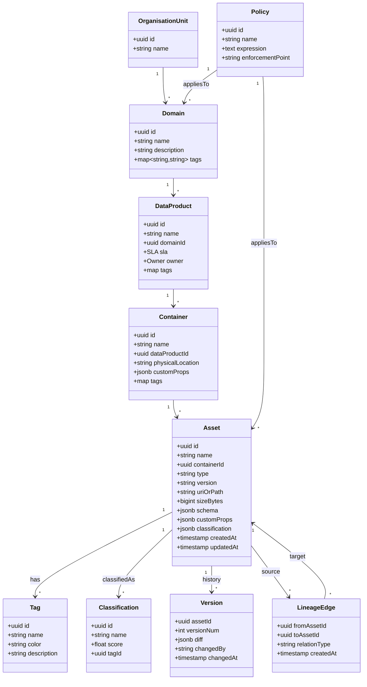
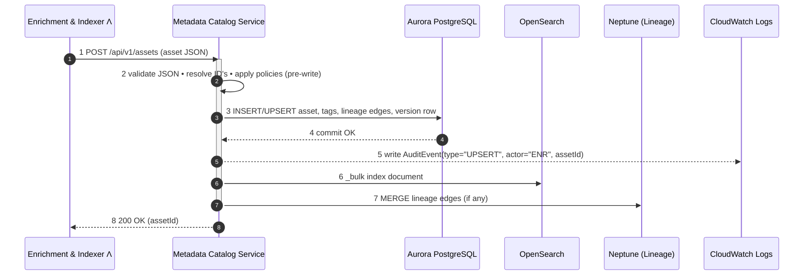
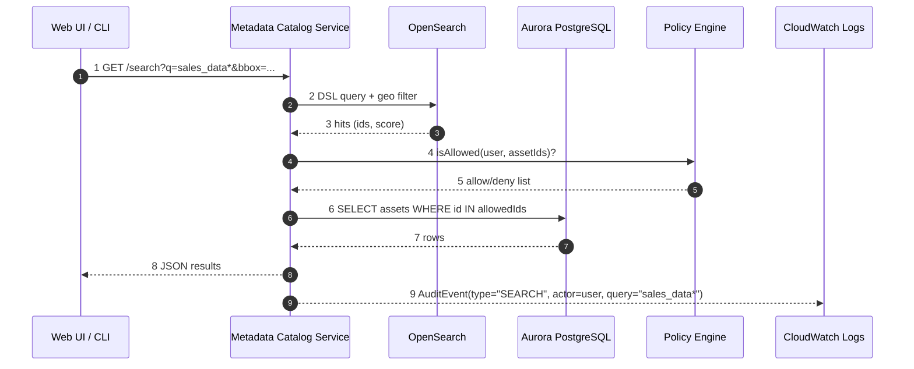
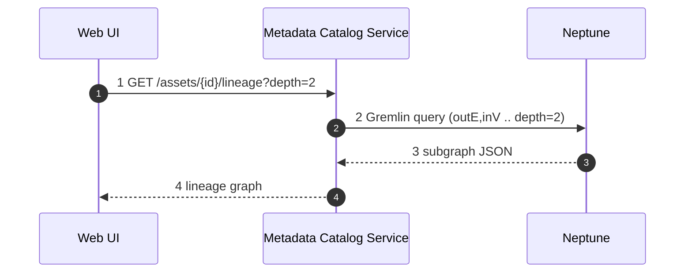

# Metadata Catalog Service

The **Metadata Catalog Service (MCS)** is the authoritative system of record for all metadata inside Project Lion.  
It runs the OpenMetadata server backed by Aurora PostgreSQL/PostGIS and exposes rich REST & GraphQL APIs that power search, governance, lineage, and access‑control flows across the platform.

## 1. Core Responsibilities

| #   | Capability          | What it does                                                                                                                                                                       |
| --- | ------------------- | ---------------------------------------------------------------------------------------------------------------------------------------------------------------------------------- |
| 1   | **Ingest**          | Receives UPSERT calls from the **Enrichment & Indexer** via the OpenMetadata API, recording assets, tags, lineage, policies, and versions.                                         |
| 2   | **Persist**         | Stores structured metadata in **Aurora PostgreSQL** (JSONB + PostGIS extensions for spatial fields).                                                                               |
| 3   | **Index**           | Publishes change notifications to an internal hook that updates **OpenSearch** indices within < 1 s for sub‑second discovery.                                                      |
| 4   | **Serve**           | Exposes REST / GraphQL / WebSocket APIs for UIs, CLIs, SDKs, and other services (Policy Engine, Lineage Graph, Access Broker).                                                     |
| 5   | **Govern**          | Enforces entity‑level RBAC and attribute‑based rules, delegating final allow/deny decisions to the Policy Engine but acting as the source of tags, classifications, and ownership. |
| 6   | **Version & Audit** | Keeps full change history per asset (spec diff + user context) for time‑travel queries and audit reports.                                                                          |

## 2. Technology Stack

| Concern        | Choice                                     | Notes                                                          |
| -------------- | ------------------------------------------ | -------------------------------------------------------------- |
| Catalog engine | **OpenMetadata 1.8**                       | Community‑backed, extensible via custom entities & properties. |
| Database       | **Aurora PostgreSQL 17 + PostGIS**         | JSONB for flexible schema, spatial types for geodata.          |
| Search         | **OpenSearch 2.x**                         | Fed by MCS notification hooks.                                 |
| Lineage proxy  | **Amazon Neptune**                         | MCS emits edge events that the Lineage Graph ingests.          |
| Runtime        | ECS Fargate or K8s (prod) / Docker (local) | Stateless containers.                                          |
| API Auth       | JWT + API Keys + service‑to‑service IAM    | Fine‑grained scopes map to OpenMetadata roles.                 |

---

## 3. Data Model Primer

Project Lion reuses the native OpenMetadata hierarchy - **Domain -> Data Product -> Container -> Asset** - with tenant (Organisation Unit) at the root.  
Custom entities and properties extend the standard model to capture spatial footprint, compliance tags, and rich audit/version data.

## 4. High‑Level Sequence - **Detailed Flows**

### 4.1 Asset Ingestion & Indexing

*The write finishes only after both indexing calls succeed, ensuring search consistency.*

### 4.2 Interactive Search & Retrieve

### 4.3 Lineage Exploration

> **Note**: MCS enforces access checks *before* returning any lineage node not owned by the caller's domain.

---

## 5. Deployment Footprint & Scaling

| Environment           | Topology                                                                          |
| --------------------- | --------------------------------------------------------------------------------- |
| **Prod**              | 3 × Fargate tasks (OpenMetadata), Aurora PostgreSQL cluster. (Or pachaget in k8s) |
| **Dev**               | Single Docker Compose (`om + pg + os`)                                            |
| **Disaster Recovery** | Cross‑Region read replica + nightly S3 snapshot of JSON export                    |

---

## 6. Failure Handling

| Failure                    | Behaviour                                                                                   |
| -------------------------- | ------------------------------------------------------------------------------------------- |
| **DB write fails**         | API returns 5xx; Enrichment retries (at‑least‑once).                                        |
| **OpenSearch unreachable** | Catalog write still commits; hook retries with exponential back‑off until index consistent. |
| **Neptune unavailable**    | Lineage edge persistence is retried; asset remains browsable.                               |
