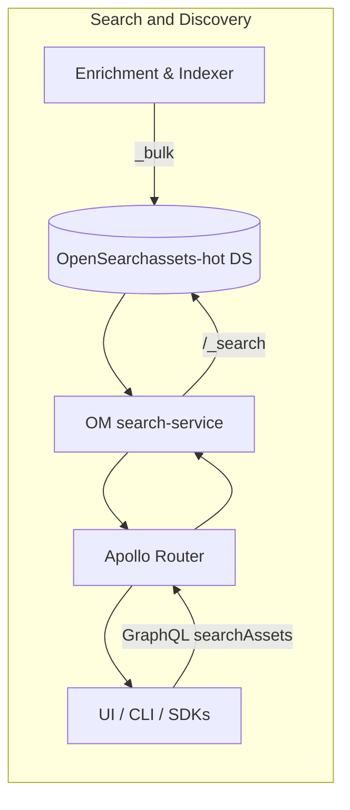
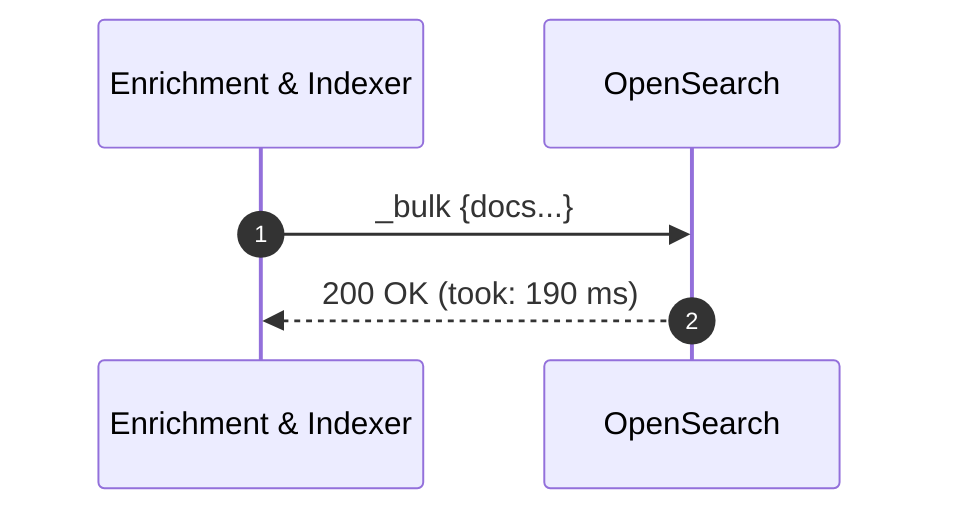
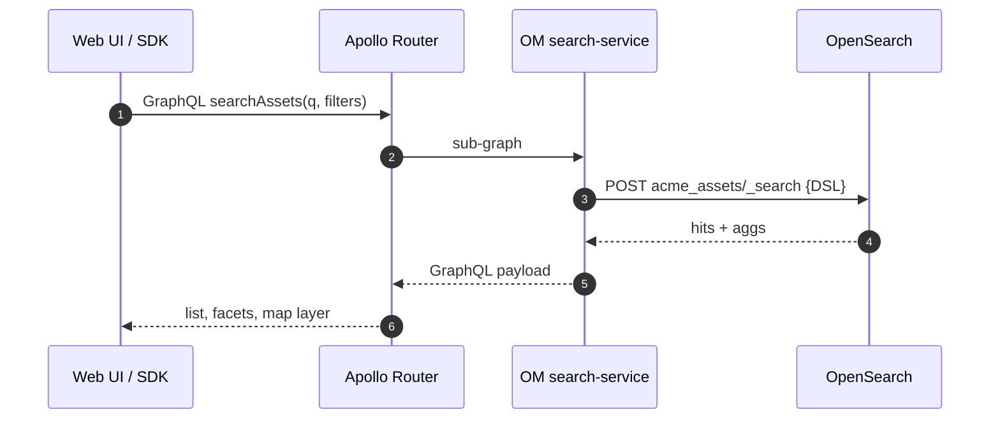

# Search & Discovery Service

The **Search & Discovery** service turns raw catalog records into an intuitive "Google like" experience.  
It is built on **AWS OpenSearch** and the **OpenMetadata search‑service** sub‑graph, providing full‑text, faceted and geo‑spatial queries.

## 1. Core Responsibilities

| #   | Capability       | Detail                                                                                           |
| --- | ---------------- | ------------------------------------------------------------------------------------------------ |
| 1   | **Index**        | Accepts `_bulk` payloads from the Enrichment & Indexer; writes to the `assets-hot` data‑stream.  |
| 2   | **Search**       | Exposes GraphQL search via the OpenMetadata search‑service.                                      |
| 3   | **Facets & Geo** | Supports tag facets, numeric ranges, and `geo_shape` intersects queries on asset bounding boxes. |

## 2. Technology Stack

| Concern       | Choice                                        | Rationale                                                                                      |
| ------------- | --------------------------------------------- | ---------------------------------------------------------------------------------------------- |
| Search engine | **OpenSearch 2.x Serverless**                 | Burst scaling; zero node ops.                                                                  |
| Search API    | OpenMetadata search‑service                   | Generates DSL queries, merges RBAC filters, surfaces GraphQL.                                  |
| Gateway       | `apollo-router` federation                    | Combines catalog, search, lineage sub‑graphs **if we not using Mono-GraphQL for all services** |
| Index ingest  | `_bulk` from Enrichment & Indexer (Go/Python) | Buld insertion                                                                                 |

## 3. Index & Document Model

OpenSearch stores a **flattened JSON document** per asset.  
During indexing the Lambda lifts the geo metadata stored in `customProps.geo` (stringified GeoJSON) and **extracts only the bounding box** to populate the `bbox` field so that spatial queries remain fast. Other geo details stay in the `_source` for UI use.

```json
{
  "asset_id": 88234955,
  "tenant_id": "acme",
  "name": "ORD_2025_05_29.csv",
  "tags": ["domain:sales","pii:yes","geo:US"],    // keyword + text
  "bbox": [-97.19,30.87,-97.12,30.94],            // geo_shape
  "geo": "{ \"type\":\"Polygon\", ... }",          // raw GeoJSON inside _source
  "columns": [ { "name":"amount","dtype":"decimal"} ], // nested
  "size_bytes": 12345,
  "created_at": "2025‑05‑29T02:40:11Z"
}
```

> **Note:** Only `bbox` is mapped as `geo_shape`; the full GeoJSON lives unchanged for future features.

## 4. High‑Level Architecture



## 5. Sequence Diagrams

### 5.1 Index‑Update Pipeline



### 5.2 User Search Flow



## 6. Failure Handling

| Failure            | Behaviour                                                                               |
| ------------------ | --------------------------------------------------------------------------------------- |
| **OpenSearch 5xx** | Retry with exponential back‑off; if > 3 retries, Lambda DLQ triggers Operational alarm. |


## 8. Security

- **Document‑level security** enforced by per‑tenant alias with `term` filter【5:0†turn5file0†L31-L37】.
- **SigV4 IAM** auth from search‑service; no static passwords.
- **Field‑level security** hides operational fields like `_ingest_ts`, `popularity_score` from user tokens【5:0†turn5file0†L37-L38】.

---

## 9. Open Questions

1. **Vector search** - migrate to k‑NN for semantic search when Bedrock embeddings land.
2. **Cross‑region reads** - evaluate replicated Serverless Collections or S3 snapshot restore.
3. **Relevancy ML loop** - feed clickstream back into popularity_score nightly.

---

*Last reviewed:* 30 Jun 2025
