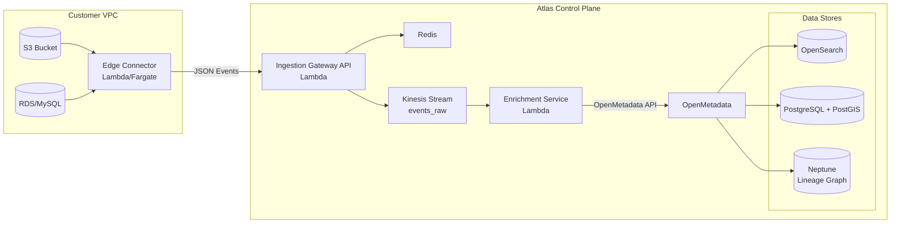
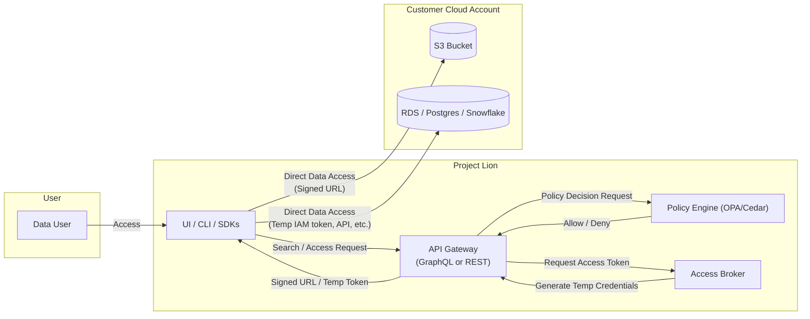

# High-Level Architecture

This page describes the high-level architecture for Project Lion, focusing on cataloging and governance. Project Lion is designed as a light-footprint, "governance-only" service that connects to a customer’s existing data stores.

## Conceptual Overview

Project Lion acts as a centralized metadata hub and governance layer. It discovers, catalogs, and governs data residing in customer environments (e.g., S3, MySQL, PostgreSQL, Snowflake, Data Lakes) without copying the raw data. Only metadata and policy information are managed by Project Lion.

The key data flow is: *Metadata Ingestion ➜ Enrichment & Security Tagging ➜ Cataloging ➜ Secure Dissemination & Access Brokering*.

## System Architecture Diagram

The following diagram illustrates the main components and interactions within the Project Lion:

**Key Components in the Diagram:**

* **Edge Connector (Customer VPC):** A lightweight agent deployed in the customer's VPC. It listens for metadata events or actively polls data sources, sending only metadata (not raw data) to the Project Lion Platform.
* **Project Lion Catalog & Governance Platform (Multi-Tenant Core):**
  * **Ingestion Gateway:** The entry point for all metadata events from Edge Connectors.
  * **Metadata Catalog Service:** The central repository for all collected metadata (e.g., using OpenMetadata with Aurora PostgreSQL).
  * **Search & Discovery (OpenSearch):** Powers full-text search and faceted discovery over the cataloged metadata.
  * **Policy Engine (OPA/Cedar):** Enforces data governance policies based on attributes (tags) and user roles.
  * **Lineage Graph (Neptune):** Stores and serves metadata about data movements and transformations.
  * **Access Broker:** Issues time-limited, scoped credentials (e.g., signed S3 URLs, temporary database tokens) for accessing data, after policy validation.
  * **UI / CLI / SDKs:** Provides human and programmatic interfaces to interact with Project Lion.
* **Customer Cloud Account(s):** Where the actual data resides (S3, relational databases, data warehouses, event streams). Project Lion accesses data here only through authorized, time-limited credentials brokered by the Access Broker.

## Data Flow (Happy Path - Example for S3 Ingestion)

### Metadata Ingestion Flow

**Step 1: Event Detection**
When a new file is uploaded to a customer's S3 bucket, AWS automatically generates an S3 ObjectCreated event. This event is captured by the Edge Connector Lambda function running in the customer's AWS account.

**Step 2: Metadata Extraction** 
The Edge Connector Lambda extracts key metadata from the S3 event, including:

- Object key and bucket name
- File size and checksum
- Timestamps (created, modified)
- Custom tags (such as geospatial footprint from S3 object tags or filename patterns)

**Step 3: Event Streaming**
The Lambda function sends this raw metadata as a JSON event to the Project Lion ingestion pipeline via API, Kinesis Firehose, or similar streaming service like SQS.

**Step 4: Enrichment Processing**
The Metadata Catalog Service receives the event and enriches it with additional context:

- Maps the data to internal dataset classifications
- Applies default governance tags based on rules
- Adds organizational metadata and lineage information

**Step 5: Storage & Indexing**
The enriched metadata is then:

- Persisted in Aurora PostgreSQL for structured queries and relationships
- Indexed in OpenSearch for fast full-text search and discovery capabilities

### Data Access Flow

**Step 6: User Discovery**
When users want to find data, they query through the Project Lion UI or GraphQL/REST API, which searches the OpenSearch index to return relevant datasets.

**Step 7: Access Request**
When a user requests access to a specific S3 object, the request goes to the Policy Engine (OPA/Cedar) which evaluates:

- The user's role and attributes
- The data asset's governance tags and classification
- Organizational access policies stored in Aurora PostgreSQL

**Step 8: Policy Decision**
The Policy Engine returns an Allow/Deny decision based on the governance rules. If denied, the user receives an explanation of why access was rejected.

**Step 9: Credential Generation**
If access is approved, the Access Broker service generates time-limited, scoped credentials:

- For S3: A pre-signed URL or STS AssumeRole with specific permissions and expiration
- For databases: Temporary access tokens
- Credentials are scoped to only the requested resource

**Step 10: Direct Data Access**
The user receives the signed URL through the Project Lion interface and uses it to access the data directly from the customer's S3 bucket. (**NOTE: Project Lion may proxy data in future**).
