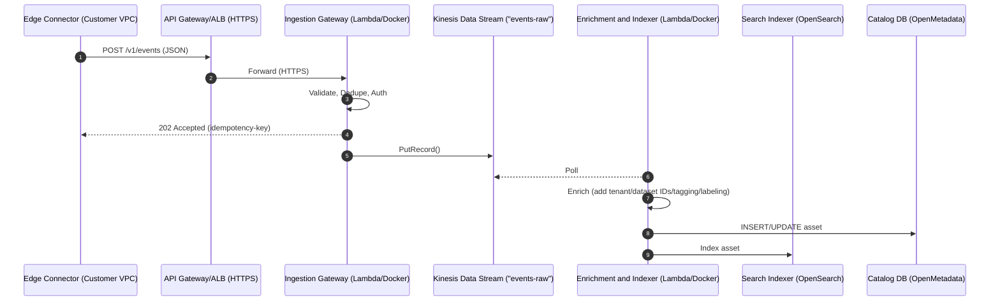

The Ingestion Gateway is the single, secure entry point for all metadata events flowing from customer-deployed Edge Connectors into the Project Lion platform. It is designed to be stateless and scalable service that shields downstream systems from direct exposure and handles initial validation, authentication, and routing of incoming metadata.

## Core Responsibilities

1. **Authentication & Authorization:** Validates credentials for incoming requests from Edge Connectors. Performs initial checks.
2. **Schema Validation:** Ensures incoming event payloads conform to the defined JSON schema for metadata events.
3. **Deduplication:** Utilizes a Redis-based idempotency key check to prevent processing duplicate events (60-minute window to start).
4. **Event Buffering & Forwarding:** Batches validated and unique events and forwards them to a durable, ordered raw event stream (Kinesis Data Streams `events-raw`).
5. **Acknowledgement:** Quickly acknowledges receipt of events to the Edge Connector HTTP `202 Accepted` with the idempotency key.

The Ingestion Gateway does not:

- Write directly to the primary metadata catalog (database).
- Perform complex event transformations or enrichments (this is handled by downstream services).
- Make fine-grained policy decisions on metadata (this is handled by the Policy Engine).

## High-Level Sequence Diagram

## Component Breakdown

| Layer                            | Technology/Service                                           | Purpose                                                                                         |
| -------------------------------- | ------------------------------------------------------------ | ----------------------------------------------------------------------------------------------- |
| **API Gateway or Load Balancer** | AWS API Gateway or Application Load Balancer (ALB)           | Forwards only to `/v1/events` and `/v1/ping` (health check when on ALB).                                    |
| **Gateway Service**              | NestJS/Fastify/Express + TypeScript (Node.js), Lambda/Docker, Redis | JSON schema validation, Redis deduplication.                                                    |
| **Raw Event Stream**             | AWS Kinesis Data Streams (`events-raw`)                      | 24-hour retention. Ensures at-least-once delivery and replayability.                            |
| **Enrichment**                   | NestJS/Node.js/Go (Fargate/Lambda)                                  | Adds tenant/dataset FKs, geo data. Most processing here. Write to OpenMetadata & OpenSearch. |

## API Surface (Example)

Endpoint: `POST /v1/events`

- **Summary:** Ingest metadata events from Edge Connectors.
- **Security:** Bearer Authentication (JWT).
- **Request Body:** JSON payload validated to `IngestEvent` schema.
  - Key fields: `idempotencyKey`, `tenantId`, `eventType`, `timestamp`, `source` (details like S3 bucket/key/size/eTag, or JDBC info), `additional field` (geo data, csv fields, etc.).
- **Responses:**
  - `202 Accepted`: Event batch received and queued. Includes `Idempotency-Key` header in response.
  - `400 Bad Request`: Validation error (e.g., schema mismatch, missing fields).
  - `401 Unauthorized` / `403 Forbidden`: Auth failure.
  - `429 Too Many Requests`: Tenant quota exceeded.

## Security & Tenancy

- **Authentication:** JWT.
- **Authorization:** The Gateway performs initial authorization by validating the tenant token and checking against tenant-specific ingestion quotas. **Fine-grained, resource-specific policy enforcement occurs downstream.**
- **Isolation:** Events are tagged with `tenantId`.

## Failure Handling

- **Gateway 5xx (Internal Error):** Edge Connectors are expected to retry with exponential backoff. The `idempotencyKey` prevents duplicate processing on retry.
- **Kinesis Stream Throttling/Full:** The Gateway will return `503 Service Unavailable` to the Edge Connector but will log a warning and emit a CloudWatch metric (`event_drop=1`). Alarms will trigger if the drop rate exceeds a defined threshold (>1% over 5 minutes), indicating a need to scale Kinesis shards or investigate downstream consumers.
- **Redis Unreachable:** The Gateway will return `503 Service Unavailable` if Redis is down, as idempotency cannot be guaranteed.
